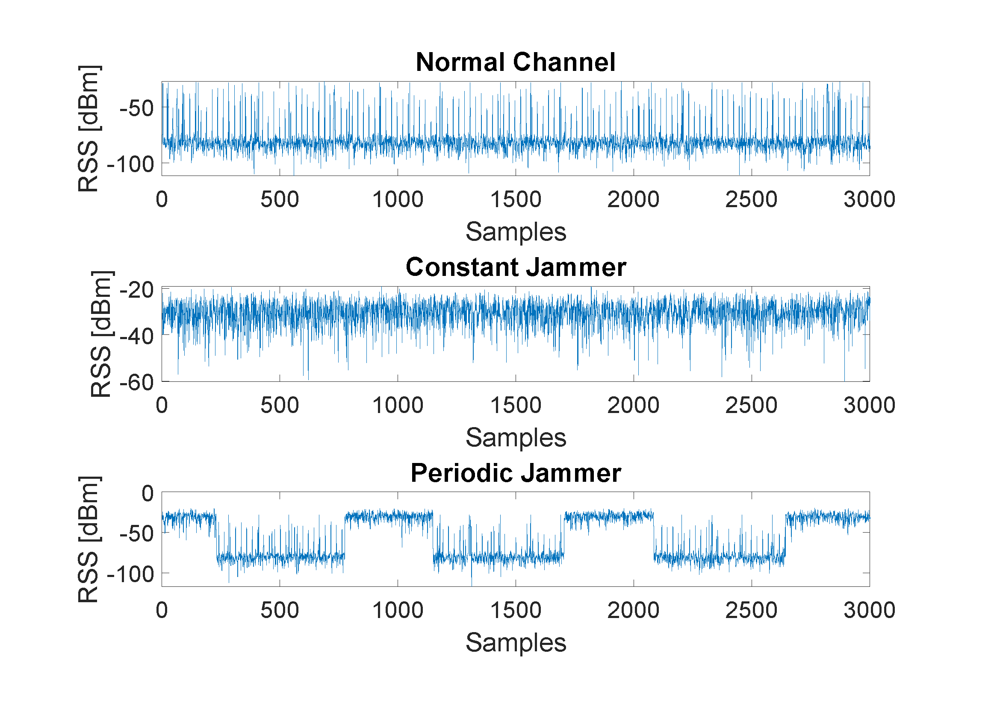
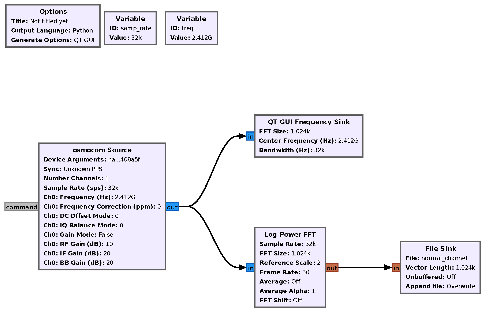

# Jamming Detection in IoT Wireless Networks: An Edge-AI Based Approach - Dataset & Code

Jamming Detection in IoT Wireless Networks using TinyML - Code and Dataset. This repository is dedicated to the distribution of the Code and dataset collected as well as used in ***Jamming Detection in IoT Wireless Networks: An Edge-AI Based Approach*** paper ([Published]), ([ResearchGate]), accepted and presented at the [IoT 2022]; by Ahmed Hussain ([Qatar University]), Nada Abughanam ([Qatar University]), and Junaid Qadir ([Qatar University]).

***The maintainer of this repository is Ahmed Hussain. For any inquiries, please email him @ ahmhus@kth.se***

# Dataset 
### Each dataset corresponds to the following Jamming type (click on the name for direct access to the RAW files):
- [Normal Channel](https://raw.githubusercontent.com/AMHD/Jamming-Detection-in-IoT-Wireless-Networks-An-Edge-AI-Based-Approach/main/normal_channel.txt)
- [Constant Jammer](https://raw.githubusercontent.com/AMHD/Jamming-Detection-in-IoT-Wireless-Networks-An-Edge-AI-Based-Approach/main/constant_jammer.txt)
- [Random Jammer](https://raw.githubusercontent.com/AMHD/Jamming-Detection-in-IoT-Wireless-Networks-An-Edge-AI-Based-Approach/main/random_jammer.txt)

Please refer to the [Published] for more information on how the data is collected.

### Each dataset file contains one column:

- **Received Signal Strength (RSS)**

<p align="center">
     
</p>

# Code 
### Implementation:

The [Code] is initially implemented in [GNURadio] as shown in the flow graph below, then converted to Python code. Please refer to the [Published] paper for more details about the setup and the parameters selected in the code/flow graph

<p align="center">
     
</p>

### Citing this work
When using this dataset, please make sure to cite the paper as follows:

```
@inproceedings{hussain2022jamming,
	author = {Hussain, Ahmed and Abughanam, Nada and Qadir, Junaid and Mohamed, Amr},
	title = "{Jamming Detection in IoT Wireless Networks: An Edge-AI Based Approach}",
	year = {2023},
	isbn = {9781450396653},
	publisher = {Association for Computing Machinery},
	address = {New York, NY, USA},
	url = {https://doi.org/10.1145/3567445.3567456},
	doi = {10.1145/3567445.3567456},
	booktitle = {Proceedings of the 12th International Conference on the Internet of Things},
	pages = {57–64},
	numpages = {8},
	keywords = {Edge AI, Jamming, TinyML, Internet of Things, Wireless Communication, Tensorflow, Deep Learning},
	location = {Delft, Netherlands},
	series = {IoT '22}
}
```
or
```
@inproceedings{hussain2022jamming,
  title={Jamming Detection in IoT Wireless Networks: An Edge-AI Based Approach},
  author={Hussain, Ahmed and Abughanam, Nada and Qadir, Junaid and Mohamed, Amr},
  booktitle={Proceedings of the 12th International Conference on the Internet of Things},
  pages={57--64},
  year={2022}
}
```

## License
[GPL-3.0](https://github.com/AMHD/Jamming-Detection-in-IoT-Wireless-Networks-An-Edge-AI-Based-Approach/blob/main/LICENSE)

[Qatar University]: <http://www.qu.edu.qa/>
[IoT 2022]: <https://iot-conference.org/iot2022/>
[Published]: <https://dl.acm.org/doi/10.1145/3567445.3567456>
[ResearchGate]: <https://www.researchgate.net/publication/364355931_Jamming_Detection_in_IoT_Wireless_Networks_An_Edge-AI_Based_Approach>
[Code]: <https://github.com/AMHD/Jamming-Detection-in-IoT-Wireless-Networks-An-Edge-AI-Based-Approach/blob/main/top_block.py>
[GNURadio]: <https://github.com/gnuradio/gnuradio>
